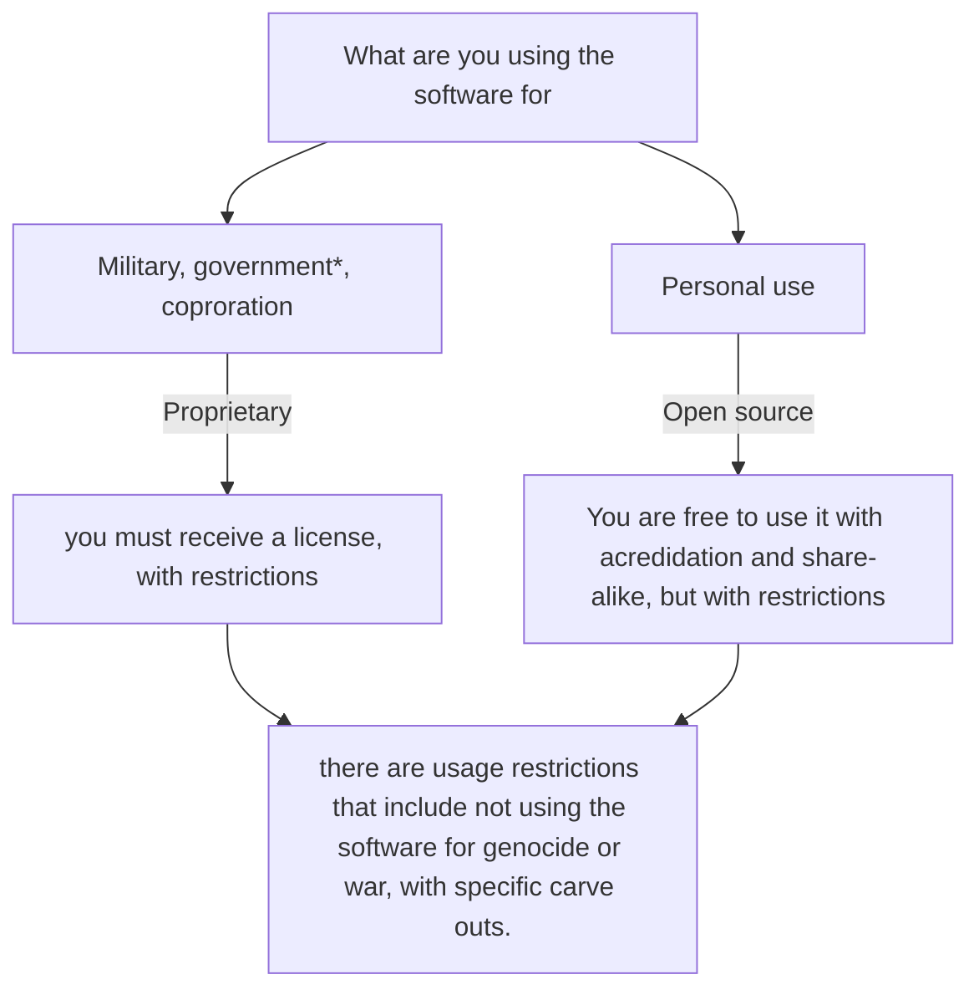

### What is it?
This is a self made license that I am writing. 

### Why?
I found that releasing my work into the world brings me great anxiety. Someone may use my work  for military, or making guns or just things I don't want it to be used for.

This license is not open source. Instead it is a combination of a proprietary and open source license, depending on who you are.

Heres a handy chart:



### Things to consider:
- although for the most part this license does not allow it to be used for war, murder, genocide, and intentional beneficiaries of war cannot use the software protected by it, there is one intentional and large exception, which is the Ukrainian government. I am Ukrainian and very bias. If you do not want this, you are free to copy the license and remove that part.


### The license on the license
Timur license by Ostap Tymchenko is marked with CC0 1.0 

---

The license:
```markdown
Copyright (c) NAME,
EMAIL

## Timur proprietary and open source license agreement

### I. For individual use, open-source
For non-commercial, individual, non-company, and non-government usage, you may use and share this software, as long as you agree to the following terms:

1. Share-alike 
2. With attribution
3. Non-commercial
4. With use exclusions, outlined in section III (USE EXCLUSION) section
5. With liability outlined in section IV (LIABILITY)
6. With no extra restriction on its distribution or usage

This is similar to CC BY-NC-SA 4.0, but distinctly it has usage exclusions and liability, laid out in section III, and IV respectively, and the Share-alike is to THIS LICENSE, not CC BY-NC-SA 4.0.

### II. For industry use, proprietary
For commercial, industrial, company, and government usage you may only use this software by:

Contacting and buying a license for its usage.

To contact the creator please see the email address in the header.

Even with a license, usage restrictions still apply laid out in (III) USAGE RESTRICTIONS, and liability, outlined in (IV) LIABILITY.

### III. Usage exclusions
1. Any entity that participates in, or supports financially and or materially, or purposely, knowingly, significantly benefits financially or materially from 
    1. The industries of War, Defense, or Military.
    2. Participates in crimes like Genocide, mass murder, and other crimes outlined in the Rome statute, Part 2, Article 6.

1. But, excluding, meaning to be able to be used by the Ukrainian military, and any military or non-military medical institutions that comply with the four Geneva Conventions of 1949.

### IV. Liability 
THE SOFTWARE IS PROVIDED "AS IS", WITHOUT WARRANTY OF ANY KIND, EXPRESS OR
IMPLIED, INCLUDING BUT NOT LIMITED TO THE WARRANTIES OF MERCHANTABILITY,
FITNESS FOR A PARTICULAR PURPOSE AND NONINFRINGEMENT. IN NO EVENT SHALL THE
AUTHORS OR COPYRIGHT HOLDERS BE LIABLE FOR ANY CLAIM, DAMAGES OR OTHER
LIABILITY, WHETHER IN AN ACTION OF CONTRACT, TORT OR OTHERWISE, ARISING FROM,
OUT OF OR IN CONNECTION WITH THE SOFTWARE OR THE USE OR OTHER DEALINGS IN THE
SOFTWARE.
```

